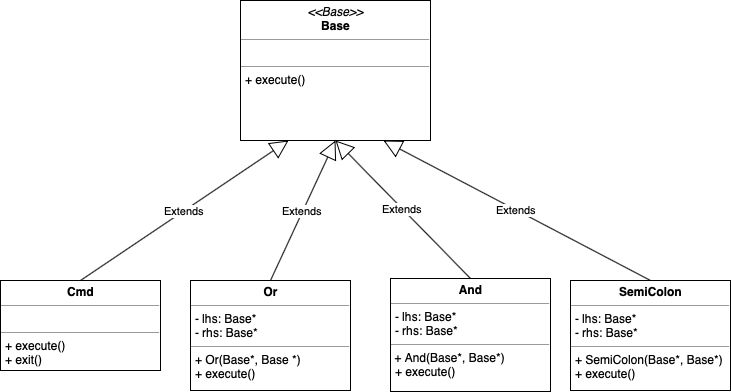

# Shell Program

## Project Information: 
Project for our class at UCR
Quarter: Spring 2019
  Name and SID: Ariel Lira (862125470) & Bohan Zhang (861215636)

## Introduction:
This program will be a command shell that will be able to perform (&&) and (||) connectors aswell as be able to execute commands chained together with semicolons. We will be using composite patterns to create our shell. This program will be similar to the command line we use in the terminal/command prompt.

## Diagram:

## Classes:
* __Rshell__: This class take user input command as string and decide execute functions based on the command input. 
* __Base__: This will be the very base class from which cmd and connector inherit from.
* __Cmd__: This class includes the execute a list of arguments using the functions execvp(), fork(), and waitdpid(). Descriptions of what each function does is stated below. It will also have an exit() function so that a person can exit the rshell.
* __Or__: This class includes function with how to deal with the connector || in a line of commands. It will execute the command on the right if the command on the left returns an error.
* __And__: This class includes function with how to deal with the connector && in a line of commands. It will execute the command on the right if the command on the left executes successfully.
* __Semicolon__: This class includes function with how to deal with the ; in a line of commands. It will execute the command on the right regardless if the command on the left returns an error or not.

## Prototypes/Research:
* __waitpid()__: This function stops the execution of a calling process until a specific child process
finishes. Depending on the value of pid, it can specify which specific child process it waits for.
* __fork()__: Creates a child process that runs at the same time the parent process does. It returns a 
process ID. If it is negative, it could not create a child process. If it is zero it is from the child process and a positive value if it returns the process ID of the child process.
* __execvp()__: This function will execute the arguments that are in an array of character strings in the second argument that is given to the function. The first arguments is the name of the file that will be executed.
## Development:
- [x] Research the functions of waitpid(), fork(), and execvp()
- [x] Begin thinking about composite pattern to use
- [x] Begin thinking about classes to be used
- [x] Begin implementing classes in code
- [x] Add functions to each of the classes.
- [x] Create CMake files
- [x] Updated unit tests
- [x] Finish RShell
- [x] Updated integration tests
- [x] Added precedency of the commands to RShell
- [x] Added test command to Rshell
- [x] Added pipe to rshell
